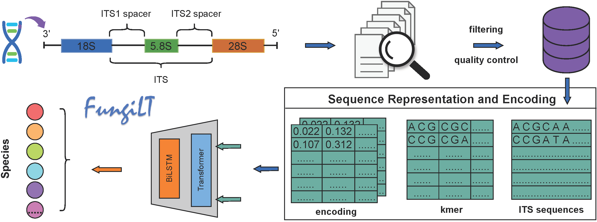

# fungilt
a deep learning framework for robust classification of fungal species from ITS sequences



## 1 Environment configuration

You can choose to clone this project in its entirety

```git clone https://github.com/liukai2410/fungilt.git```
